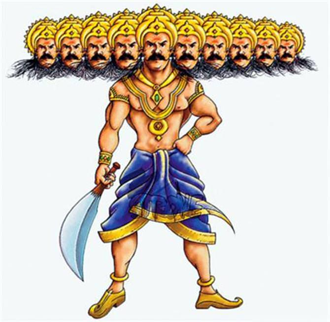

# Quest

## Once upon a time, there were twins - a brother and sister, named Jack and Bailey.  They had much in common, that's for sure, such as their black, black hair, and their love for Nellie, their dog.  But there's one thing Jack and Bailey cannot live without. (Not Nellie, but nice try.) 

## It was their portable trampoline! Those two brought it everywhere.  Literally, EVERYWHERE.  The airport, the grocery store, the doctor's office, everywhere.  Including, unfortunately, school. 

## Almost every day, a note came home saying: "Jack and Bailey jumping during class... AGAIN. Please make them keep the trampoline home. Signed, Mrs. Jennafer."  But they didn't listen.  They kept on bringing the thing.  Until... 

According to Hindu scriptures, Lord Ram was born on the the day of Ram Navami. After the increase of iniquity, Lord Bishnu, who came to earth as "Ram", killed Ravana. But many do not know that Ravan's death was possible due to a small mistake. Else, even Lord Ram could not have killed him.

## Ravan invited his death due to his small mistake
King of Lanka "Ravan" wanted to conquer the whole world. But he knew that his dream could not come true without god's blessings. So he began to do great penance to please his anestor god Brahma.
